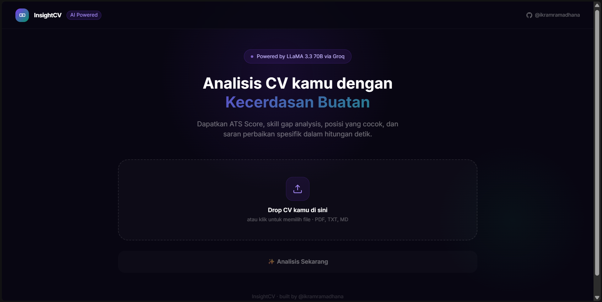
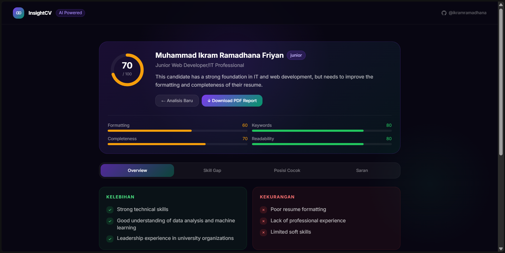
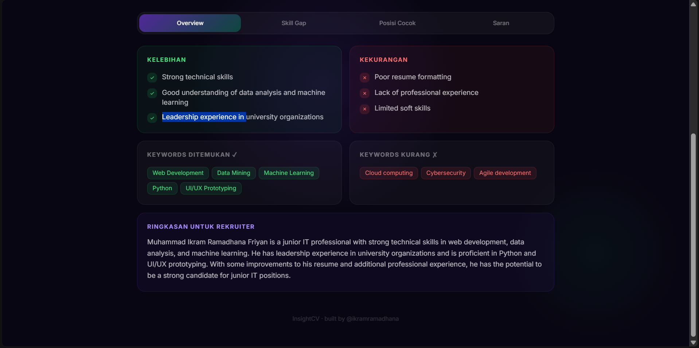

# InsightCV 

**AI-powered Resume Analyzer** — Upload CV kamu dan dapatkan analisis mendalam: ATS Score, skill gap, posisi yang cocok, dan saran perbaikan spesifik dalam hitungan detik.

> Built by [@ikramramadhana](https://github.com/ikramramadhana)

---

## Apa itu InsightCV?

InsightCV adalah aplikasi web yang menggunakan **Large Language Model (LLM)** untuk menganalisis CV/resume secara otomatis. Tidak seperti ATS checker biasa yang hanya mencocokkan kata kunci, InsightCV menggunakan AI untuk memahami konteks, menilai kualitas konten, dan memberikan saran yang actionable.

Cocok untuk:
- Mahasiswa yang baru membuat CV pertama kali
- Fresh graduate yang mau melamar kerja
- Professional yang ingin upgrade CV mereka
- Siapa saja yang ingin tahu seberapa kuat CV mereka di mata rekruiter

---

## Fitur

- 📊 **ATS Score (0–100)** — skor kelayakan CV dengan breakdown per kategori: formatting, keywords, completeness, dan readability
- 🎯 **Skill Gap Analysis** — technical skills, soft skills, dan sertifikasi yang perlu ditambahkan
- 💼 **Posisi yang Cocok** — rekomendasi top 3 posisi berdasarkan isi CV beserta persentase kesesuaian
- 💡 **Saran Improvement** — saran perbaikan spesifik per section, diurutkan dari prioritas high → medium → low
- 🔍 **Keywords Analysis** — keywords yang sudah ada dan yang masih kurang di CV kamu
- 👔 **Recruiter Summary** — ringkasan 2–3 kalimat cara rekruiter membaca CV kamu
- 📄 **Download PDF Report** — hasil analisis lengkap bisa didownload sebagai file PDF

---

## Cara Kerja Sistem

### Alur Analisis

```
User upload CV (PDF / TXT)
        ↓
Ekstraksi teks (pdf-parse)
        ↓
Teks CV dikirim ke Groq API sebagai prompt
        ↓
LLM (LLaMA 3.3 70B) menganalisis CV secara menyeluruh
        ↓
Response JSON terstruktur dikembalikan ke frontend
        ↓
Hasil ditampilkan: ATS Score, Skill Gap, Posisi, Saran
        ↓
User bisa download PDF Report
```

### Kenapa LLaMA 3.3 70B?

Model ini dipilih karena:
- **70 Billion parameters** — jauh lebih pintar dari model 8B untuk task analisis kompleks
- **Via Groq** — inferensi sangat cepat (< 5 detik untuk analisis penuh)
- **Gratis** di tier developer Groq
- Mampu memahami konteks CV secara holistic, bukan sekadar keyword matching

---

## Tech Stack

| Layer | Teknologi | Keterangan |
|---|---|---|
| **Frontend** | Next.js 14 (App Router) | React framework dengan file-based routing |
| **Styling** | Tailwind CSS | Utility-first CSS |
| **Backend** | Next.js API Routes | Serverless functions, Node.js runtime |
| **LLM** | Groq API — `llama-3.3-70b-versatile` | Analisis CV dengan AI |
| **PDF Parsing** | pdf-parse v1.1.1 | Ekstraksi teks dari file PDF |
| **PDF Export** | jsPDF | Generate laporan PDF di client-side |
| **Deployment** | Vercel | Serverless hosting, auto-deploy dari GitHub |

---

## Struktur Project

```
insightcv/
├── app/
│   ├── page.tsx                  # UI utama — upload, hasil analisis, tabs
│   ├── layout.tsx                # Root layout + metadata
│   └── api/
│       └── analyze/route.ts      # POST — ekstrak PDF + analisis dengan Groq
├── public/                       # Static assets
├── .env.local                    # Environment variables (tidak di-commit)
├── vercel.json                   # Konfigurasi Vercel (maxDuration 60s)
└── README.md
```

---

## Setup Lokal

### 1. Clone & Install

```bash
git clone https://github.com/ikramramadhana/insightcv.git
cd insightcv
npm install
```

### 2. Dapatkan Groq API Key (gratis)

1. Buka [console.groq.com](https://console.groq.com)
2. Daftar / login dengan Google
3. Klik **API Keys** → **Create API Key**
4. Copy API key yang dimulai dengan `gsk_...`

### 3. Buat file `.env.local`

```env
GROQ_API_KEY=gsk_xxxxxxxxxxxxxxxxxxxxxx
```

### 4. Jalankan

```bash
npm run dev
```

Buka [http://localhost:3000](http://localhost:3000)

---

## Deploy ke Vercel

### 1. Push ke GitHub

```bash
git init
git add .
git commit -m "init: InsightCV — AI Resume Analyzer"
git remote add origin https://github.com/ikramramadhana/insightcv.git
git branch -M main
git push -u origin main
```

### 2. Import di Vercel

1. Buka [vercel.com](https://vercel.com) → **Add New Project**
2. Import repo `insightcv` dari GitHub
3. Framework preset: **Next.js** (otomatis terdeteksi)
4. Tambahkan **Environment Variables**:

| Name | Value |
|---|---|
| `GROQ_API_KEY` | `gsk_xxxxxxxxxxxxxx` |

5. Klik **Deploy** ✅

---

## Environment Variables

| Variable | Keterangan | Wajib |
|---|---|---|
| `GROQ_API_KEY` | API key dari [console.groq.com](https://console.groq.com) | ✅ Ya |

---

## Keterbatasan

- PDF hasil **scan/foto** tidak bisa dibaca (butuh OCR — teks harus selectable)
- Analisis bergantung pada kualitas teks yang bisa diekstrak dari PDF
- Model AI bisa saja memberikan saran yang tidak 100% sesuai konteks lokal Indonesia — gunakan sebagai panduan, bukan keputusan final
- Tidak ada autentikasi — semua analisis bersifat stateless (tidak disimpan di database)

---

## Lisensi

MIT License — bebas digunakan dan dimodifikasi.

---

## Project Preview





---

Built by [@ikramramadhana](https://github.com/ikramramadhana)